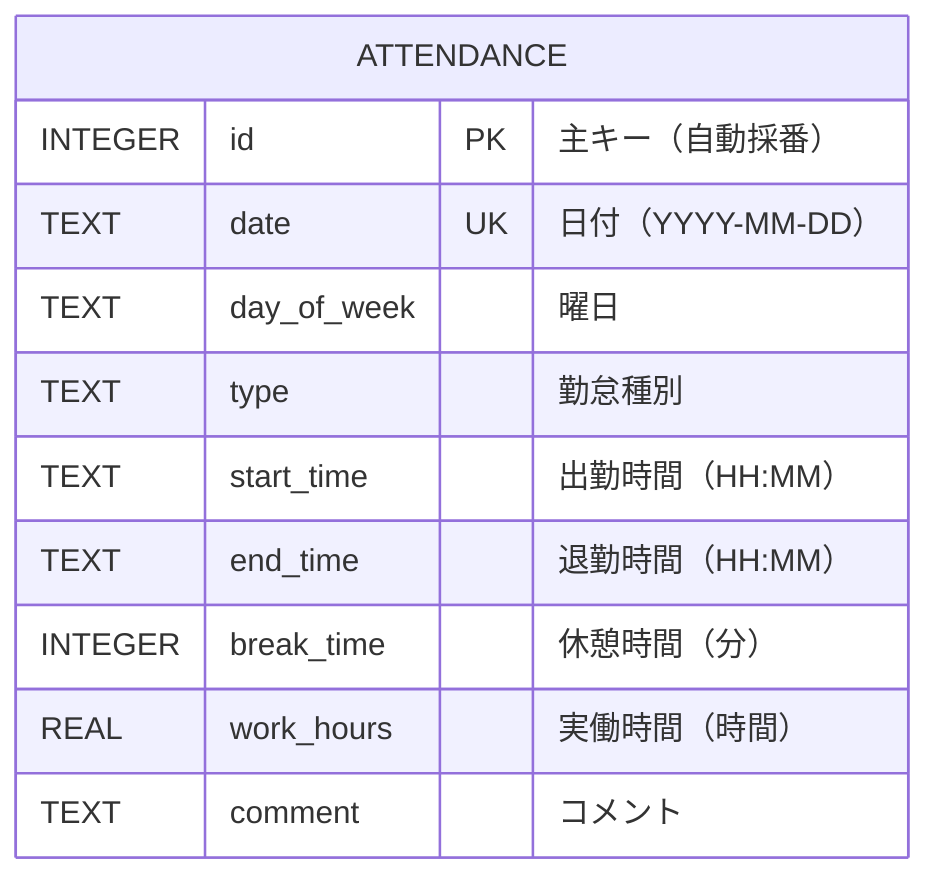

# データベース設計

## E-R図



## テーブル設計

### attendance テーブル

勤怠データを格納するメインテーブルです。

| カラム名 | データ型 | 制約 | 説明 |
|----------|----------|------|------|
| id | INTEGER | PRIMARY KEY AUTOINCREMENT | 主キー（自動採番） |
| date | TEXT | NOT NULL UNIQUE | 日付（YYYY-MM-DD形式） |
| day_of_week | TEXT | NOT NULL | 曜日（月、火、水、木、金、土、日） |
| type | TEXT | NOT NULL | 勤怠種別 |
| start_time | TEXT | NULL | 出勤時間（HH:MM形式） |
| end_time | TEXT | NULL | 退勤時間（HH:MM形式） |
| break_time | INTEGER | DEFAULT 0 | 休憩時間（分単位） |
| work_hours | REAL | DEFAULT 0 | 実働時間（時間単位、小数点2桁） |
| comment | TEXT | NULL | コメント |

### インデックス設計

```sql
-- 主キーインデックス（自動作成）
CREATE UNIQUE INDEX idx_attendance_id ON attendance(id);

-- 日付ユニークインデックス（自動作成）
CREATE UNIQUE INDEX idx_attendance_date ON attendance(date);

-- 日付範囲検索用インデックス（将来の拡張用）
-- CREATE INDEX idx_attendance_date_range ON attendance(date, type);
```

## データ制約

### 必須項目
- `date`: 日付は必須
- `day_of_week`: 曜日は必須
- `type`: 勤怠種別は必須

### 一意制約
- `date`: 1日につき1レコードのみ

### デフォルト値
- `break_time`: 0分
- `work_hours`: 0時間

## 勤怠種別マスタ

アプリケーション内で定義される勤怠種別の一覧です。

| 種別コード | 表示名 | 説明 |
|------------|--------|------|
| - | - | デフォルト（土日） |
| フレックス | フレックス | フレックスタイム勤務 |
| 在宅勤務 | 在宅勤務 | リモートワーク |
| 午前休 | 午前休 | 午前半休 |
| 午後休 | 午後休 | 午後半休 |
| 休暇 | 休暇 | 有給休暇等 |
| 祝祭日 | 祝祭日 | 国民の祝日 |

## データ例

### サンプルデータ

```sql
INSERT INTO attendance VALUES 
(1, '2025-06-25', '水', 'フレックス', '09:00', '18:00', 60, 8.0, 'テスト勤怠データ'),
(2, '2025-06-26', '木', '在宅勤務', '09:30', '17:30', 45, 7.25, 'リモートワーク'),
(3, '2025-06-27', '金', '午前休', '13:00', '18:00', 30, 4.5, '午前中病院'),
(4, '2025-06-28', '土', '-', '', '', 0, 0, '土曜日'),
(5, '2025-06-29', '日', '-', '', '', 0, 0, '日曜日');
```

## データ整合性

### バリデーションルール

1. **時間整合性**
   - 出勤時間 < 退勤時間
   - 休憩時間 < 総勤務時間

2. **時間形式**
   - 時間は HH:MM 形式（24時間制）
   - 例: 09:00, 18:30

3. **数値範囲**
   - 休憩時間: 0以上
   - 実働時間: 0以上

4. **日付形式**
   - YYYY-MM-DD 形式
   - 例: 2025-06-25

### 計算ロジック

#### 実働時間計算
```python
def calculate_work_hours(start_time, end_time, break_time):
    """
    実働時間 = 退勤時間 - 出勤時間 - 休憩時間
    """
    if not start_time or not end_time:
        return 0
    
    start = datetime.strptime(start_time, '%H:%M')
    end = datetime.strptime(end_time, '%H:%M')
    
    diff_minutes = (end - start).total_seconds() / 60
    work_minutes = diff_minutes - break_time
    
    return round(work_minutes / 60, 2) if work_minutes > 0 else 0
```

#### 曜日計算
```python
def get_day_of_week(date_str):
    """
    日付から曜日を計算
    """
    date_obj = datetime.strptime(date_str, '%Y-%m-%d')
    days = ['月', '火', '水', '木', '金', '土', '日']
    return days[date_obj.weekday()]
```

## データベース操作

### 基本CRUD操作

#### 作成（Create）
```sql
INSERT OR REPLACE INTO attendance 
(date, day_of_week, type, start_time, end_time, break_time, work_hours, comment)
VALUES (?, ?, ?, ?, ?, ?, ?, ?);
```

#### 読み取り（Read）
```sql
-- 全件取得（日付順）
SELECT date, day_of_week, type, start_time, end_time, break_time, work_hours, comment
FROM attendance
ORDER BY date DESC;

-- 期間指定取得
SELECT * FROM attendance 
WHERE date BETWEEN '2025-06-01' AND '2025-06-30'
ORDER BY date;
```

#### 更新（Update）
```sql
-- INSERT OR REPLACE を使用して更新
INSERT OR REPLACE INTO attendance 
(date, day_of_week, type, start_time, end_time, break_time, work_hours, comment)
VALUES ('2025-06-25', '水', 'フレックス', '09:00', '18:00', 60, 8.0, '更新されたコメント');
```

#### 削除（Delete）
```sql
-- 特定日付のデータ削除
DELETE FROM attendance WHERE date = '2025-06-25';

-- 期間指定削除
DELETE FROM attendance WHERE date < '2025-01-01';
```

## パフォーマンス考慮事項

### SQLite特性
- **ファイルベース**: 単一ファイルでデータ管理
- **軽量**: 小〜中規模データに適している
- **ACID準拠**: トランザクション保証
- **同時接続制限**: 書き込み時は排他制御

### 最適化ポイント
1. **インデックス活用**: 日付検索の高速化
2. **バッチ処理**: CSV取込時の一括処理
3. **接続管理**: 適切な接続開閉
4. **データ型選択**: 適切なデータ型の使用

## 将来の拡張計画

### テーブル追加予定

#### users テーブル（認証機能）
```sql
CREATE TABLE users (
    id INTEGER PRIMARY KEY AUTOINCREMENT,
    username TEXT NOT NULL UNIQUE,
    email TEXT NOT NULL UNIQUE,
    password_hash TEXT NOT NULL,
    role TEXT DEFAULT 'user',
    created_at DATETIME DEFAULT CURRENT_TIMESTAMP
);
```

#### departments テーブル（部署管理）
```sql
CREATE TABLE departments (
    id INTEGER PRIMARY KEY AUTOINCREMENT,
    name TEXT NOT NULL UNIQUE,
    description TEXT
);
```

### リレーション追加
- attendance.user_id → users.id
- users.department_id → departments.id

### データベース移行
- SQLite → PostgreSQL/MySQL
- 水平分散対応
- レプリケーション設定

## バックアップ・復旧

### バックアップ戦略
```bash
# SQLiteファイルのバックアップ
cp kintai.db kintai_backup_$(date +%Y%m%d_%H%M%S).db

# SQLダンプ作成
sqlite3 kintai.db .dump > kintai_backup.sql
```

### 復旧手順
```bash
# ファイルからの復旧
cp kintai_backup_20250625_120000.db kintai.db

# SQLダンプからの復旧
sqlite3 kintai_new.db < kintai_backup.sql
```

## データ移行

### CSV形式でのデータ移行
```python
# エクスポート
def export_to_csv():
    conn = sqlite3.connect('kintai.db')
    df = pd.read_sql_query("SELECT * FROM attendance", conn)
    df.to_csv('attendance_export.csv', index=False, encoding='utf-8-sig')
    conn.close()

# インポート
def import_from_csv():
    df = pd.read_csv('attendance_import.csv', encoding='utf-8-sig')
    conn = sqlite3.connect('kintai.db')
    df.to_sql('attendance', conn, if_exists='append', index=False)
    conn.close()
```
